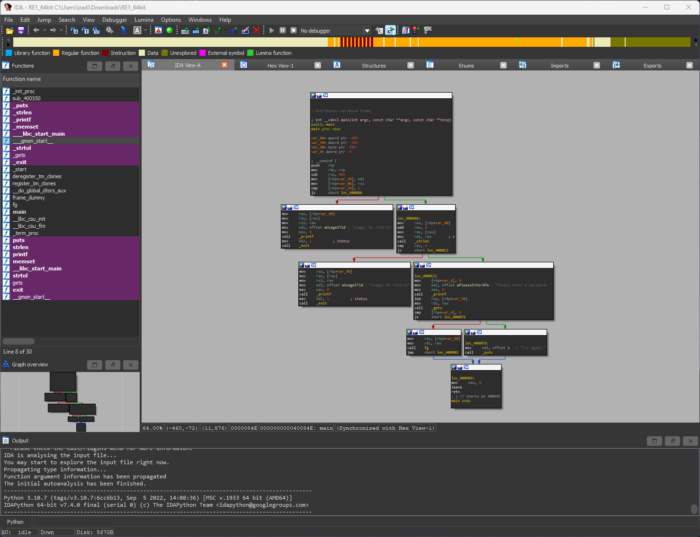
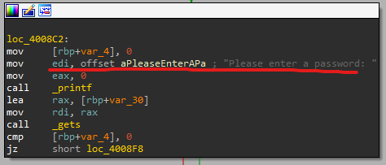
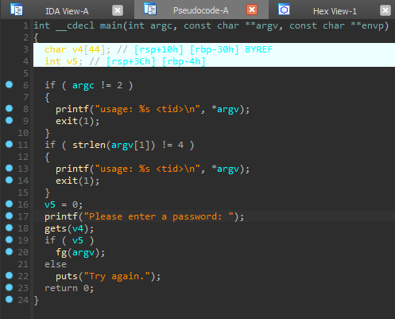
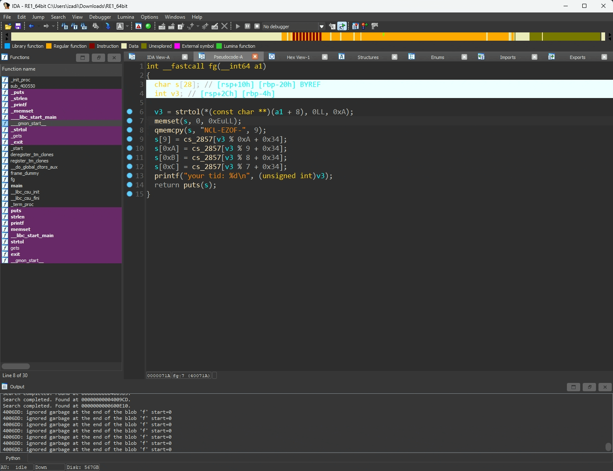
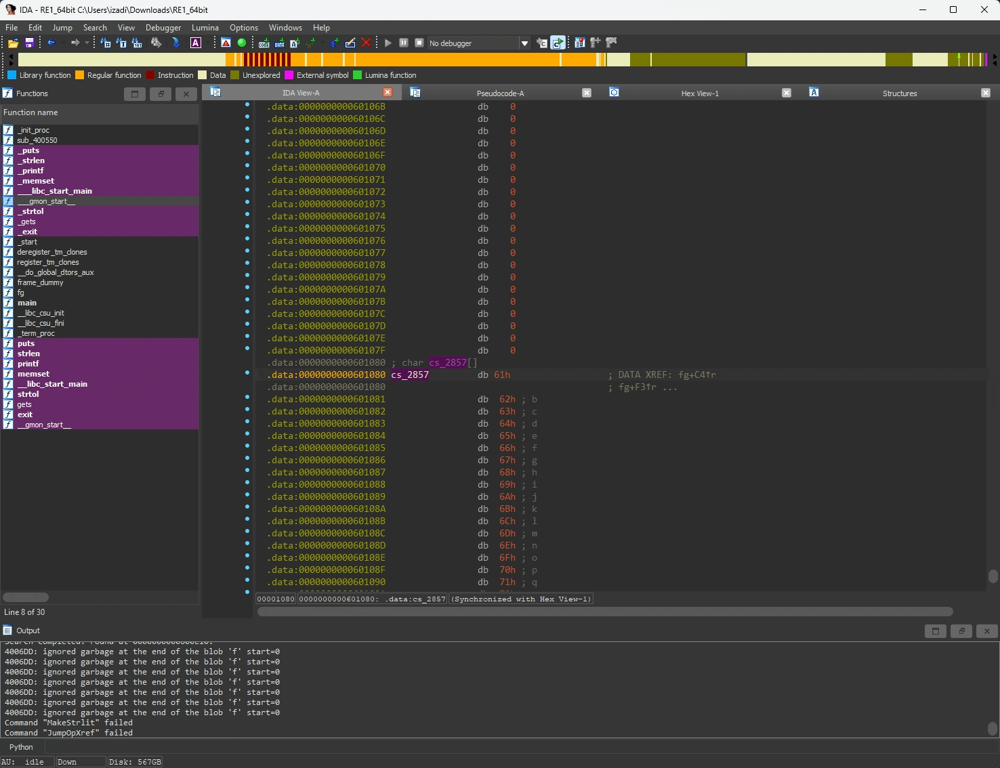

# Binary Reversing

## Given Information

Given a binary file and a identifier of 7074 that must be passed to the binary when running it.

## File Analysis

First lets get some information about the file, we can use `file` command to get the file type and `strings` to get the strings in the file.

```bash
$ file binary1
RE1_64bit: ELF 64-bit LSB executable, x86-64, version 1 (SYSV),
dynamically linked, interpreter /lib64/ld-linux-x86-64.so.2,
for GNU/Linux 2.6.24, BuildID[sha1]=8616e4f2a4a3c325c2a1f32b8ebb8366694f7a03, not stripped

$ strings binary1
/lib64/ld-linux-x86-64.so.2
fiOz
libc.so.6
gets
exit
puts
printf
strtol
strlen
memset
__libc_start_main
__gmon_start__
GLIBC_2.2.5
gfff
[]A\A]A^A_
your tid: %d
usage: %s <tid>
Please enter a password:
Try again.
;*3$
abcdefghijklmnopqrstuvwxyzABCDEFGHIJKLMNOPQRSTUVWXYZ0123456789-
GCC: (Ubuntu 4.8.4-2ubuntu1~14.04) 4.8.4
GCC: (Ubuntu 4.8.2-19ubuntu1) 4.8.2
...
```

What this tells us is that the file is an ELF 64-bit executable for linux that is not stripped. Not stripped means that the file is still contains the symbols and debug information. This is good for us because we can use this information to reverse engineer the file.

Looking at the strings command we can see that there are some interesting ones.

| String                 | Function                                |
| ---------------------- | --------------------------------------- |
| strtol                 | idk, we need to google this             |
| strlen                 | get length of string                    |
| your tid: %d           | shows us some strings are not encrypted |
| abcdefghijklmnopqrs... | idk, but could be interesting           |

## Strtol?

So we need to google `strtol` and see what it does. It turns out that it is a function that converts a string to a long integer with a given base.

## Reversing using a Decompiler (IDA)

Start by opening the file in IDA.

You will see a graph of the main function.



Zooming in on the main function we can see that there is a string being used that says "Please enter a password:".



This means we are in the right section where inputs are being handled. Now we will utilize the pseudocode view to see it in a more readable format. (Click View -> Open subviews -> Generate pseudocode)



We can see the program is testing if the passed argument is not 4 characters. If it is not 4 characters then it will print the usage and exit. After the check it will get the user input for the password and store it in the buffer v4. It will then call the function fg, passing the argument value (7074).

Next, double click the function fg to see what it does, make sure to remember the argument value (7074).



Initially we want to convert some of the hex values to decimal so we can read the code easier. Either by right clicking and setting to decimal or by using the `h` shortcut.

Finally, we can see some array is being accessed called cs_2857. Double click this too see it in the decompiler view. We can see it is a whole bunch of characters. We have seen this before when we ran the strings command. Now we know what it is for. We can convert this into a string for easier reading, right clicking and selecting the string option or by using the hotkey `a`.



Now that we have all the values being utilized we can use this pseudocode to write a c++ program to process the encryption to get the flag.

```c++
#include <iostream>

using namespace std;

int main() {
  char str[] = "abcdefghijklmnopqrstuvwxyzABCDEFGHIJKLMNOPQRSTUVWXYZ0123456789";
  long int li = strtol("7074", NULL, 10);
  char flag[13] = "NCL-EZOF-";
  flag[9] = (char)str[li % 10 + 52];
  flag[10] = (char)str[li % 9 + 52];
  flag[11] = (char)str[li % 8 + 52];
  flag[12] = (char)str[li % 7 + 52];

  cout << flag << endl;
  return 0;
}
```

Running this program will give us the flag, ignore the end non-ascii character.

```bash
$ ./buildFlag
NCL-EZOF-4024�
```
