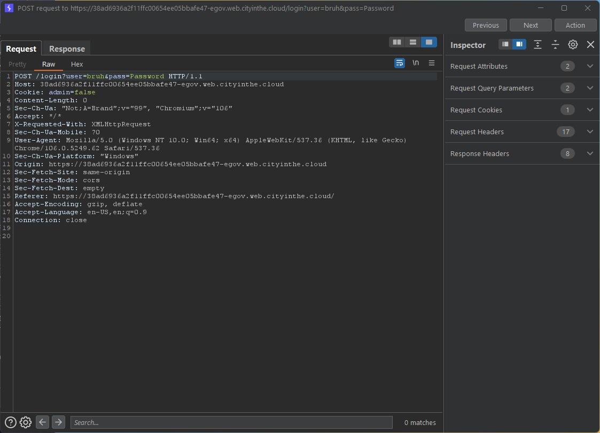

# Web App Exploitation - Cookies

## Basic Information

Looking at the website we can see that it is a login form. Using burpsuite we can intercept the request and see exactly what is going on.



We can see that a cookie being passed in the request is named `admin`. The value of it is `false`. The response is `Forbidden`. We can change this to `true` and see what happens. To do this we right click and click `Send to Repeater`.


You can see that the response to this request is `OK`. That means we are allowed to access the admin page. Now we have to find where this page is located. If we check the Javascript code in the login page we can see that the admin page is located at `/admin`.

```Javascript
$(document).on('ready', function() {
  $('#loginBtn').on('click', function(e) {
    e.preventDefault();
    var data = $('#loginForm').serialize();
    $.post('/login?' + data)
      .done(function() {
        window.location = '/admin' + window.location.search;
      })
      .fail(function(xhr, stat, err) {
        alert('Incorrect login credentials');
      });
  });
});
```

Now we just need to set the admin cookie to true and we will have access. We can do this by going into inspect element and changing the value of the cookie to true.


Now we can access the admin page, this is where the flag is located.


