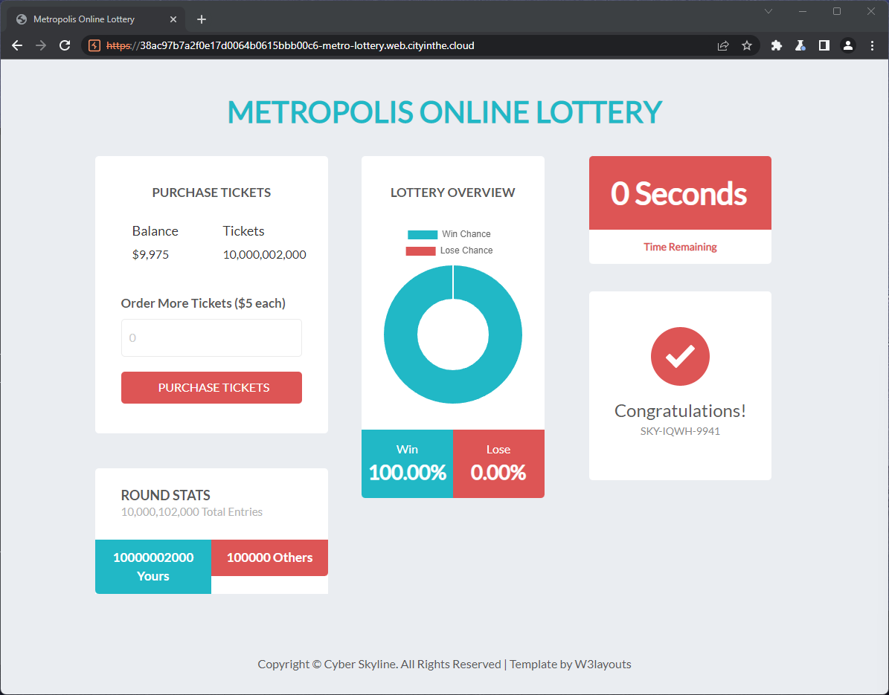

# Web App Exploitation - Weak Calls

## Basic Information

Looking at the website we can see it is a lottery system that is reset every 8 seconds. The main point of the challenge is to purchase enough tickets to win and get the flag.

Looking at the request we can see the buy ticket request gives the price of the ticket and the number of tickets we want to buy. We can see that the price is $5 and the number of tickets is 1. We can change this to $0 and 10000000000 and see what happens.


```json
{"cost":25,"tickets":5}
replace
{"cost":0,"tickets":10000000000}
```

We can see that our tickets have been purchased. Now we just need to wait for the lottery to be drawn. After we win the lottery the flag is shown.


